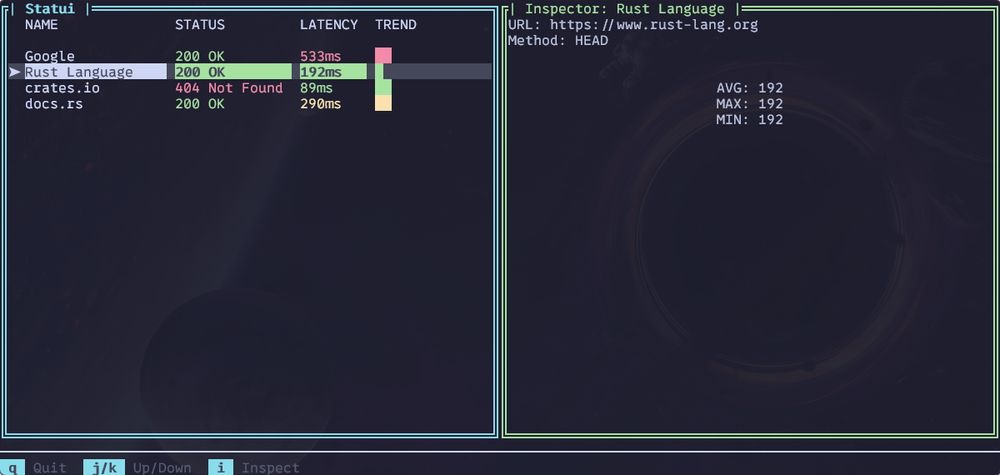

# NOTICE:

This is still in early development, and has quite a bit to go.

# Statui

A lightweight TUI dashboard for API health monitoring built with Rust and Ratatui.

# TODO

- [x] Finish up the statistics and inspector panel.
- [x] Make the UI a little prettier.
- [ ] Add search/filter using /
- [ ] Add API health check presets for various dev tools (LLMs, AI, Package repos).
- [ ] Create a demo using vhs.
- [ ] Create a proper README file.